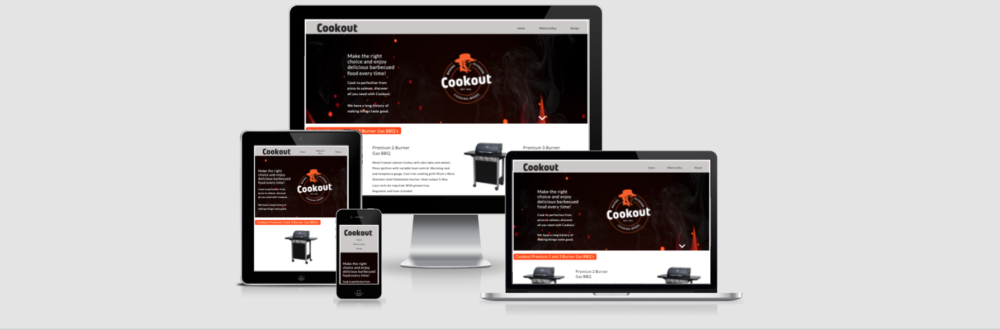
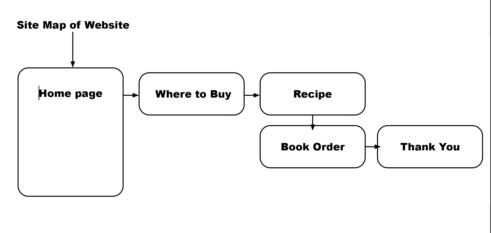
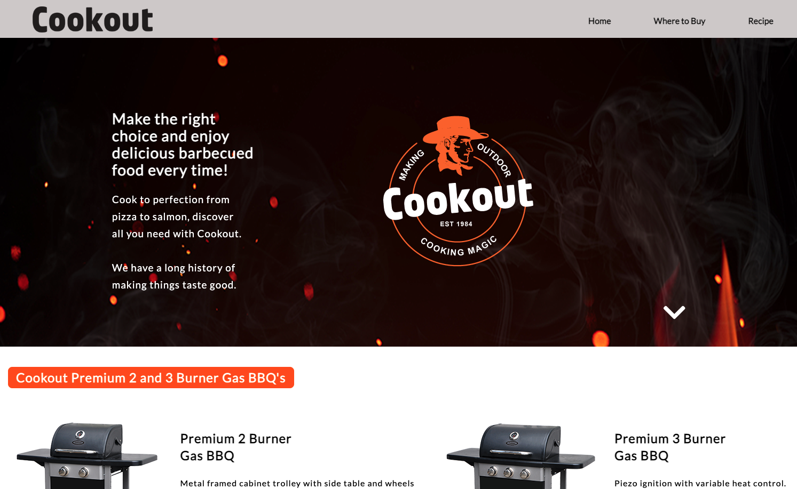
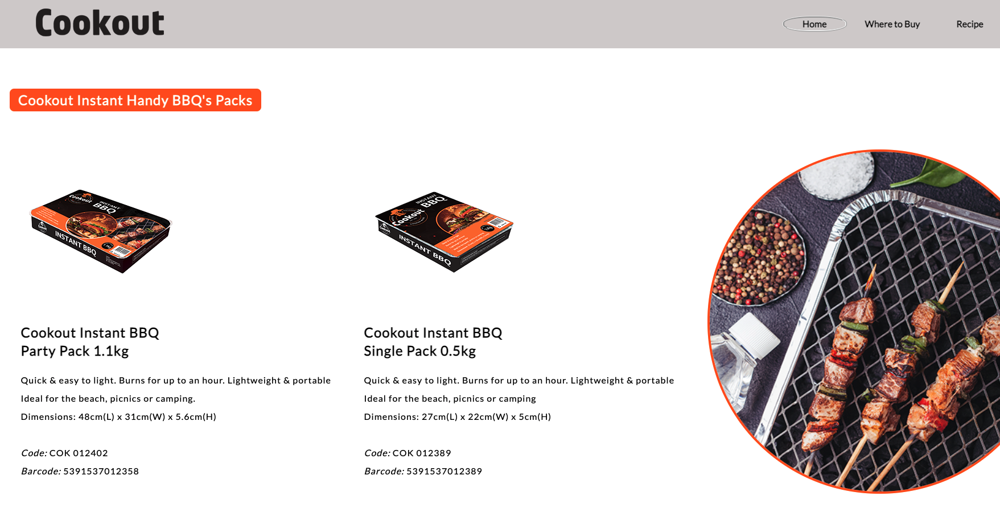
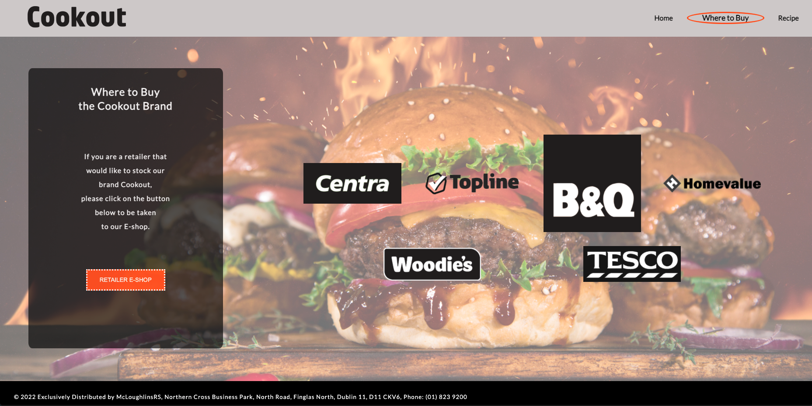
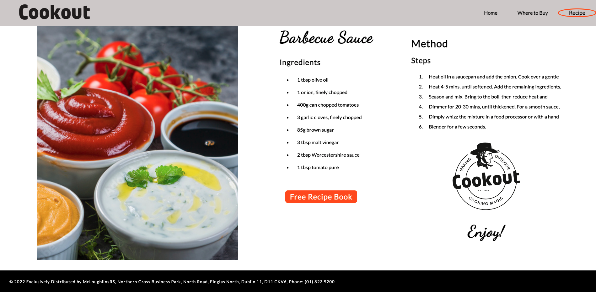
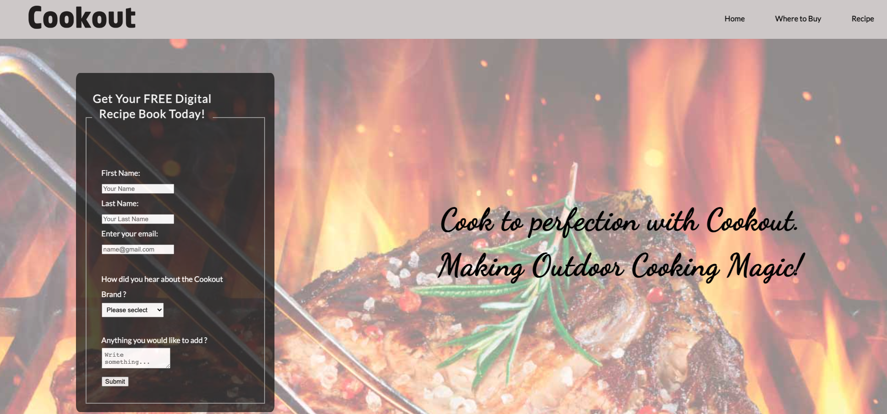
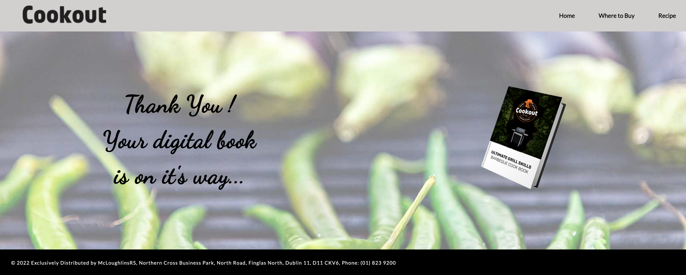

# Cookout Brand Awareness

Cookout is a brand that as been estabilished since 1984 it has gone through two new branding updates but has never had a website of it's own. It's a McLoughlinsRS own brand one of Ireland largest retail distributors of Gardening Homewares and DIY in Ireland. Cookout is sold on the B2B website but there is no information background about the product that can be shared with the customer via it's own site or being shared on retailers websites via a link. This would create more brand awareness.  

I hope this website will inspire people to get cooking outdoors and use the Cookout brand while doing so. Keeping with the brand colors and theme, a website that is easy to navigate and not taxing on the user.

# Design for More Accessibility
I wanted my site to be SEO friendly, and once you design an accessible website you will have better search results and reach a bigger audience. Navigation options that are clear and consistent, consistent naming, Styling and positioning. Have clear orientation clues, Clear labelling of any forms and have them validated.

Provide sufficient contrast between forground and background low luminace is needed for anyone that may be visually impared. Use headings and spacing to group related content, use white space, dont let it be your emeny reduce clutter and make it easier to scan and understand. Create for different viewport sizes. Include 'alt' on your images and aria-label on links. Have alternatives for images and media for example links to audio and include text along with icons and buttons. If I had included a video I would have had controls. If you design for all you get a better user experience for everyone, and it's cheaper to do at the inital stage of design process.

Adobe Xd High Fedelity Wireframe Link (https://xd.adobe.com/view/c718dec8-7b3f-4b80-7464-25e5be7b8f89-b129/)
Link to site on Github (https://nedduc.github.io/Cookout-Brand-Awareness/)

### User Story

  - As a user I would want to find out more about the brand and where to buy
  - As a user - a retailer may want to stock the brand
  - As a user I may have more questions about the product may be I did buy this product and now it needs servicing
  - As a user I may have lost the instruction to go with the product and do not know how to operate
  - As a user I want to be able to contact the supplier/distributor if there is any more information or have any more questions
  - As a user I may want to know about future products
  - As a user I may want to follow them on social media for new offerings

## Site Map

## Features 

Cookout website is five pages in total with social media links and links to retail distributors website and shopping portal.

### Features

- __Navigation Bar__

  - Featured on all five pages, the full responsive navigation bar includes links to, Home page, Where to Buy and Recipe page giving someting free to the user in the form of a BBQ recipe and digital book to download. The nav bar was made sticky so that on longer scrolling pages and mobile it was visable at all times.
  - This allows the user to easily navigate from page to page across all devices without having to revert back to the previous page via the ‘back’ button as its not always a good thing to depend on. 
  - Active selector was also added to each page on the navigation bar.

- __The landing page image__

  - Main landing page includes a light intro and brand logo, background image allows brand logo to stand out off page. 
  - Just to note, I used the three versions of the Cookout logo on this website for brand awareness and make impact on user.
  - Product images are shown on this page to show category offering from the brand. Information on products is short and concise.
  - This page is long, so I have included click down and up buttons. 
  - Social media icons are only included on the first page, otherwise I feel the user will go down rabbit hole. I want to keep the user on website.
  - On footer the address and telephone of distributor exsist and is clickable to be taken to distrubutors website.

- __Instant barbecue__

  - Image styled off page to give more interest, position was -40px, changes to centered square image on mobile.

- __Where to Buy__

  - This page shows the user where to buy the products. Logo's of stores are listed here. Links could be included to retailers website where product is sold. 
  - There is a link included to Retail distributors E-Shop as the company does not sell directly to consumer. 

- __Recipe__

  - Bright image of freshly made sauce and recipe to follow.
  - Nothing like getting something for free even if its a digital recipe book or free recipe to make sauce.
  - Maybe the next time that buyer goes into shop they remember the free 'Cookout Recipe they received and digital book'
  - By this stage the users has seen all three version of the Cookout logo.
  - Crisp, clean and uncluttered. 

- __The Footer__ 

  - The footer section includes links to the relevant social media sites for the retail distributor of the brand 'Cookout'. The links will open to a new tab to allow easy navigation for the user. 
  - Social media icons are only on main index.html page. The idea behind this is to direct the user around the website finding out about the brand.

- __Application for Digital Book__

  - Allowing the user to recieve a free digital recipe book connected to Barbeques. The user will be asked to submit their full name and email address. How they heard about the brand. Required fields need to filled in. 

- __Thank-You__

  - A message to signify to the user the process has been completed, the digital Cookout cook book is on it's way to them.

### Features Left to Implement

- Adding more new products and new recipe ideas. Once the user signs up for the recipe book, they are not a cold call anymore and can be contacted with new products and more recipe ideas.
- Links can be added to 'Where to Buy' page on the logo's to take user directly to purchase page for product.
- Add a little background softly playing cowboy music. 
- Add video tutorials on cooking, storing and servicing your Barbeque.

### Technologies used

- HTML
- CSS
- Photoshop

## Testing 

While in the Dev Tools I used the responsive tools to view site on iPad and iPhone 5. I also opened on my own Samsung 6
as well as seeing it on my iMac. I left one or two items uncentered and this created a nice pause for the eye and flow 
of reading.(you can get bored travelling in a straight line all the time i.e motorway driving) I also sent to two alternative phones.

All my links work to other websites opening in new windows not to draw the user away. Screen shots of all testing available in Testing folder.

### Validator Testing 

- HTML
  - I have passed all my html pages on W3 HTML Validator and all pages have finally received a document checking completed with no errors or warnings to show. Main errors were rogue tags and alt information added into links that did not need to be there.
- CSS
  - I also used W3 Jigsaw Validator to pass my css file, I had 9 errors and 1 warning which all have been resolved.
- Lighthouse
  - I used Lighthouse from the dev tools to show up any issues with performance, accessibility, best practice, SEO, and performance these can be found in the testing folder as screenshots.

  What I did notice was if you have a tag closing in the wrong place it wont show up as a error.(testing/Nu Html Checker w3s/line 29
  <form> not closed after fieldset link broken.png)

### Unfixed Bugs

I did not center a heading on the recipe page as I think the page reads better, it has a nice flow. White space can be important.
Unfixed bug was a user agent stylesheet that I believe is in chrome. More research needed on that.
It bugged me that the navbar did not take up less real estate on mobile.

## Deployment

In order for someone to access, I must deploy site to Github from Gitpod the container-based development platform I have been using: 
  - Make sure that I have "git added", "git commit -m" & "git push" to Github
  - Once in Github, I navigated to my sites repository - https://github.com/nedduc
  - Under my repository name, to the right of the screen click Settings.
  - In the left sidebar, click Pages.
  - Under “GitHub Pages”, use the None or Branch drop-down menu and select a publishing source.
  - Optionally, use the drop-down menu to select a folder for my publishing source.
  - Waited for page to refresh.
  - Scroll back down to Github pages section to get my deployed link.

The live link can be found here - https://nedduc.github.io/Cookout-Brand-Awareness/

## Credits 

I would like to thank my Cohort Facilitator Kasia and my mentor Maria Hynes, two very kind and patient people. My mentor gave me some great advice.
My code was helped along by W3 Schools https://www.w3schools.com/

https://www.freecodecamp.org/learn

https://css-tricks.com/pseudo-class-selectors/

http://ami.responsivedesign.is/

https://flexboxfroggy.com/ 

### Content 

- The text for the website was taken from a data base in work. Recipe courtesy of BBC Good Food Guide.
- The icons in the footer were taken from [Font Awesome](https://fontawesome.com/)

### Media

- The main photos used on each page are from Adobe stock images. Product images are from work. https://stock.adobe.com/
- The images used for the form page taken from open source site Unsplash https://unsplash.com/s/photos/bbq
- Cookout logo designed by myself as well as the packaging and digital book.

______________________________________________________________________________________________________________